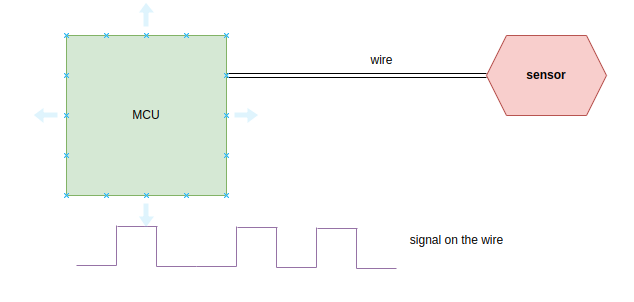
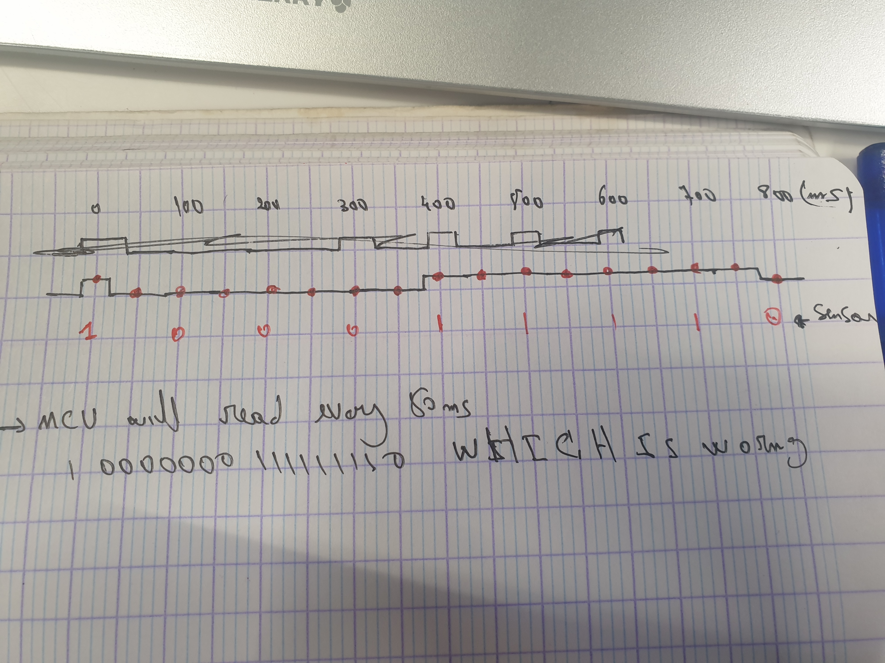
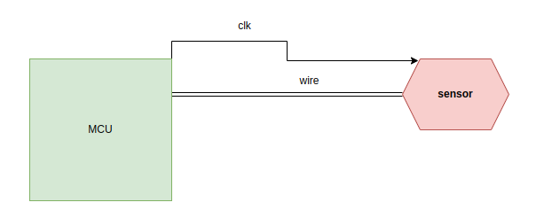

### SPI driver

##### What is SPI ?

```
spi or Serial Peripheral Interface is communication protocol what does that mean ?
let's say you have MCU and heat sensor and you want to read some data from the sensor
you are not going to just plug it to the MCU and magiclay data will be available
sensor and MCU need to agree on how to send and read here come's spi to solve the problem
```

##### How ?

```
we could connect MCU to sensor with wire and sensor will send for example 5v means 1
0v means 0
```



````
but you may see a problem here let's say heat sensor send data at rate of 10 values per second
and MCU read at rate of 20 values per
````



```
this problem solved by adding wire (clock) to sync between sensor and MCU
```


