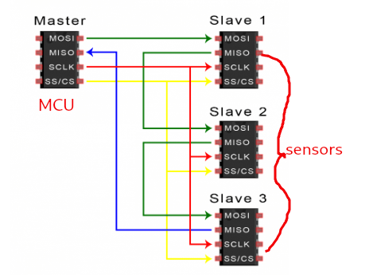
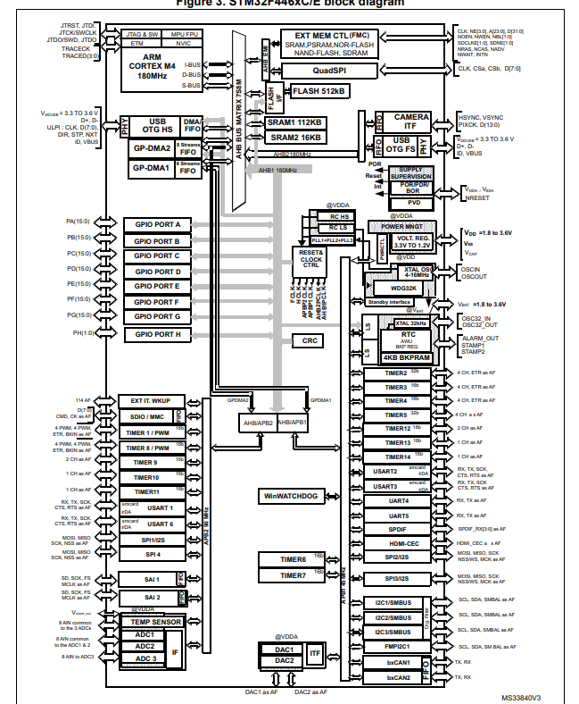
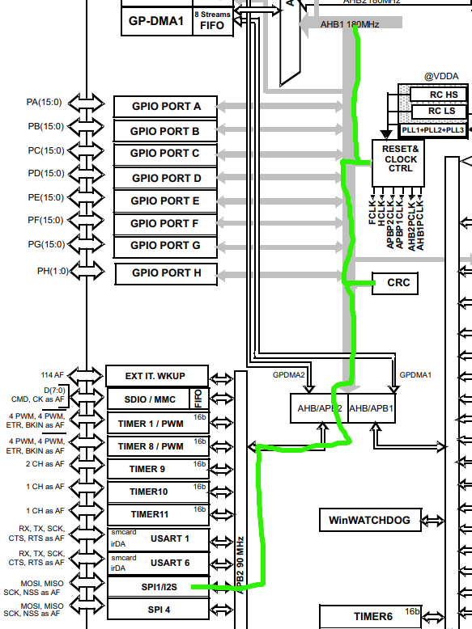
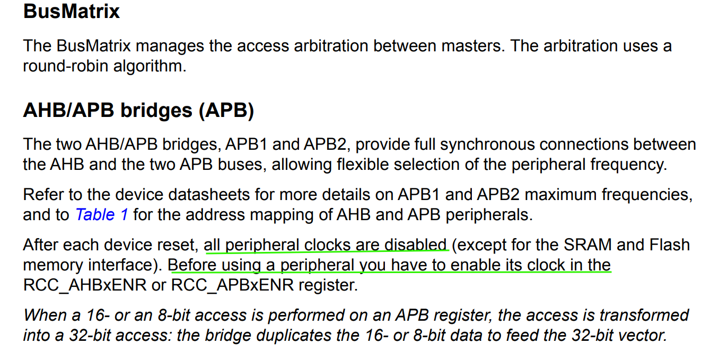
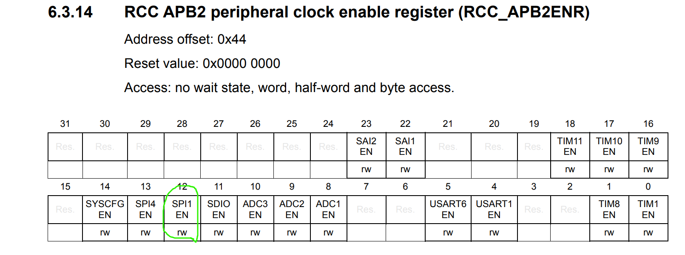
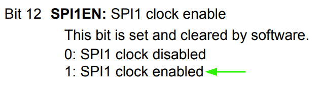
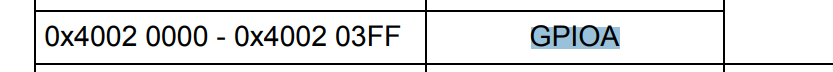
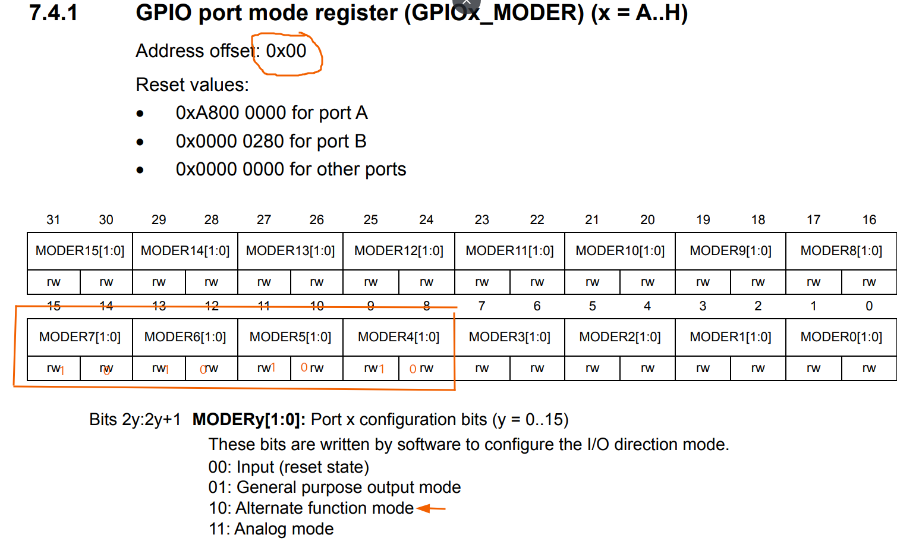
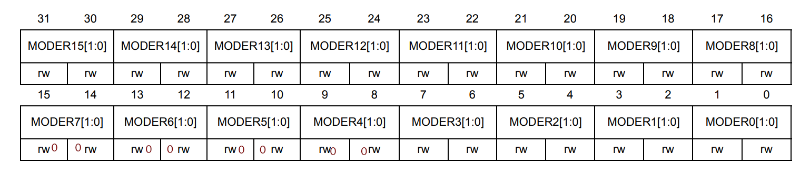

### SPI driver

##### What is SPI ?

```
spi or Serial Peripheral Interface is communication protocol what does that mean ?
let's say you have MCU and heat sensor and you want to read some data from the sensor
you are not going to just plug it to the MCU and magiclay data will be available
sensor and MCU need to agree on how to send and read here come's spi to solve the problem
```

##### How ?

```
we could connect MCU to sensor with wire and sensor will send for example 5v means 1
0v means 0
```


````
but you may see a problem here let's say heat sensor send data at rate of 10 values per second
and MCU read at rate of 20 values per
````


```
this problem solved by adding wire (clock) to sync between sensor and MCU
```


```
and we need to add other wire so we can read and write
and usually we need to talk to more than one sensor so 
we will add other wire to select which sensor that MCU
is talking to
```




#### Notes:

```
Clock polarity determines the state of the clock line when idle.
CPOL=0 Idle Low
CPOL=1 Idle High
```

````
The clock phase determines the clock edge on which the data will start
being sampled by the devices
CPHA=0: First clock edge
CPHA=1: Second clock edge
````

#### Info

```
I have stm32f446ret and it has multiple spi pins

I will choose spi1 for now

- spi1_miso: PA6 or PB4
- spi1_mosi: PA7 or PB5
- spi1_sck: PA5 or PB3
- spi1_nss: PA4 or PA15

```

##### Block Diagram



````
spi1 location well as you can see that spi1 is connected to APB2 and APB2 is connected
to AHB/APB bridge that in iteself connected to AHB1
AHB1 is connected to a clock that needs to be enabled
````




##### development process

enable ahb1 clock for GPIOA


enable apb2 aka spi1 clock





*info about GPIOA*




```

it should be cleared first and set to alternate function

```


##### *What is alternate function*

```
-general purpose I/O pins are used for any general-purpose input or output use.
this could include usingi any pin as an input for a switch or using a pin an
output for an LED

-when a GPIO pin is used for any alternate purpose (SPI, USART,...) other than as a general purpose
then it is said to be in alternate function mode
```
